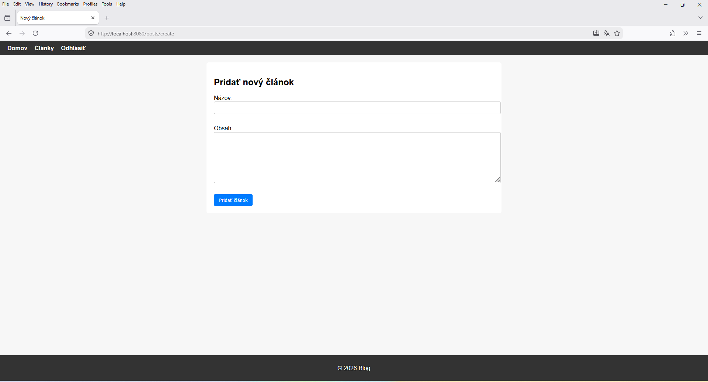
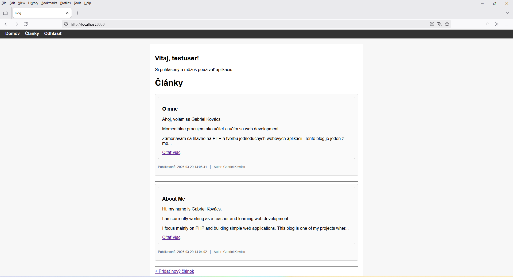
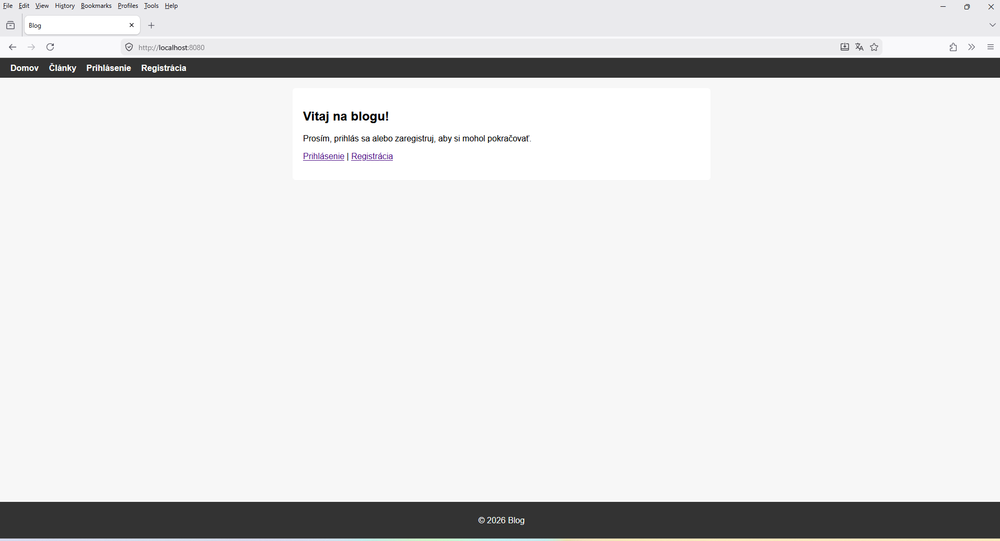
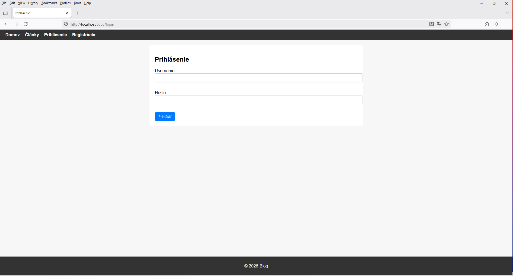

# Blog Web Application

Simple blog application built with PHP.

## Features

- Public blog with articles
- Article detail page
- Login / logout
- Admin section with full post management (CRUD)
- Responsive layout
- Custom routing system (self-built Router)

## Technologies

- PHP
- MySQL (PDO)
- HTML / CSS

## Live Demo

http://gk-blog.42web.io/

## Demo Access

- Username: testuser  
- Password: heslo123

## Screenshots

   

## Demo Account

Username: testuser  
Password: heslo123

## Purpose

This project was created as a portfolio project to demonstrate PHP backend development, database usage, and basic authentication.

---

© Gabriel Kovács 2025
